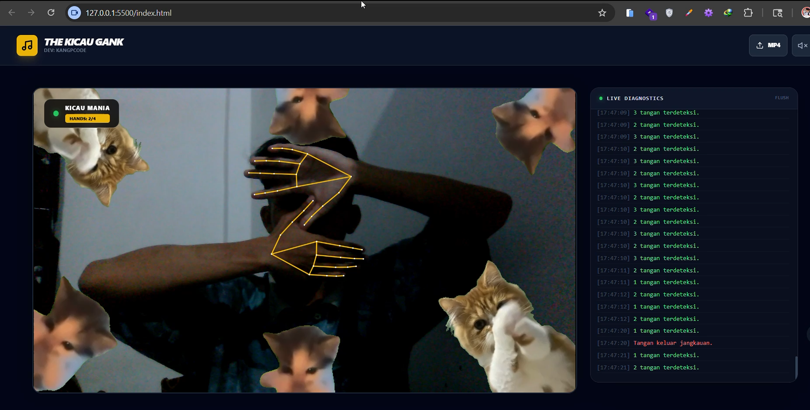

# The Kicau Gank



## Aplikasi AI Hand Tracking Interaktif dengan Animasi Kucing Menari Real-Time

The Kicau Gank adalah aplikasi web interaktif berbasis kecerdasan buatan (Artificial Intelligence) yang memanfaatkan teknologi pelacakan tangan (AI Hand Tracking) untuk mengaktifkan animasi kucing menari secara otomatis. Proyek ini dibangun menggunakan MediaPipe Hands dari Google, Tailwind CSS, dan JavaScript murni.

Ketika sistem mendeteksi dua tangan atau lebih melalui webcam, video animasi kucing menari akan muncul secara real-time dengan efek chroma key (green screen removal) yang halus dan responsif.

---

## Demo Aplikasi

Aplikasi ini dapat dijalankan langsung melalui browser modern tanpa proses instalasi tambahan.

### Fitur Demo
- Deteksi tangan real-time menggunakan webcam
- Overlay video transparan
- Upload video MP4 custom
- Log sistem interaktif
- Dukungan audio dan mute
- Resolusi Full HD 1920x1080

---

## Fitur Unggulan

### AI Hand Tracking dengan MediaPipe
Mendeteksi hingga empat tangan secara bersamaan dengan akurasi tinggi dan latensi rendah.

### Aktivasi Otomatis Berdasarkan Gesture
Video animasi akan aktif ketika minimal dua tangan terdeteksi.

### Chroma Key Processing Real-Time
Menghapus background hijau secara otomatis sehingga video tampak menyatu dengan kamera.

### Upload Video MP4 Kustom
Pengguna dapat mengganti animasi default dengan video green screen sendiri.

### Terminal Log Diagnostik
Menampilkan status sistem, jumlah tangan terdeteksi, dan aktivitas aplikasi secara langsung.

### Kontrol Audio
Tersedia tombol mute dan unmute.

### Desain Responsif
Optimal di desktop, laptop, tablet, dan smartphone.

### Output Full HD
Kamera ditampilkan dalam resolusi 1920x1080.

---

## Teknologi yang Digunakan

| Teknologi | Fungsi |
|--------|--------|
| HTML5 | Struktur aplikasi |
| Tailwind CSS | Styling modern dan responsif |
| JavaScript ES6 | Logika aplikasi |
| MediaPipe Hands | AI Hand Tracking |
| Canvas API | Rendering video dan efek |
| WebRTC | Akses kamera |
| Chroma Key Algorithm | Transparansi video |

---

## Cara Kerja Sistem

1. Browser meminta akses webcam.
2. MediaPipe mendeteksi posisi tangan secara real-time.
3. Jika jumlah tangan ≥ 2, animasi kucing menari aktif.
4. Background hijau pada video dihapus otomatis.
5. Video ditampilkan di atas feed kamera.
6. Semua aktivitas ditampilkan pada terminal log.

---

## Instalasi dan Menjalankan Proyek

### Clone Repository
```bash
git clone https://github.com/kangpcode/the-kicau-gank.git
cd the-kicau-gank

Jalankan Aplikasi

Buka file index.html di browser modern.

Berikan Izin Kamera

Izinkan browser mengakses webcam.

Mulai Interaksi

Tampilkan dua tangan atau lebih di depan kamera.

Struktur Folder Proyek
the-kicau-gank/
├── index.html
├── kicaumaniav1.mp4
├── screenshot.png
├── demo.png
├── README.md
└── LICENSE.md
Screenshot Aplikasi

Tampilan aplikasi saat sistem mendeteksi dua tangan dan animasi kucing menari aktif.

Persyaratan Browser
Google Chrome terbaru
Microsoft Edge terbaru
Mozilla Firefox terbaru
Safari terbaru
JavaScript aktif
Akses webcam
Dukungan WebGL
Use Case Aplikasi

Proyek ini cocok digunakan untuk:

Hiburan interaktif
Konten TikTok, Reels, dan YouTube Shorts
Edukasi AI dan Computer Vision
Demo MediaPipe Hands
Instalasi digital interaktif
Proyek kreatif berbasis webcam
Keunggulan Dibanding Proyek Sejenis
Tidak memerlukan backend
100% client-side
Ringan dan cepat
Mudah dimodifikasi
Mendukung video custom
Full HD
Open source
Optimasi SEO

Kata kunci utama:

AI Hand Tracking JavaScript
MediaPipe Hands Project
Aplikasi Webcam Interaktif
Kucing Menari AI
Chroma Key JavaScript
Proyek Computer Vision Browser
Source Code MediaPipe Hands
Real Time Hand Detection Web App
Pengembangan Selanjutnya

Roadmap fitur:

Gesture khusus untuk berbagai animasi
Multi karakter
Recording video
Live streaming mode
Dukungan AR effect
PWA support
Leaderboard gesture game
Penulis

Dhafa Nazula Permadi
Founder of KangPCode
Programmer, Engineer, AI Developer, dan Full Stack Web Developer.

GitHub: https://github.com/kangpcode

Lisensi

Proyek ini dilisensikan di bawah ketentuan yang terdapat pada file LICENSE.md.

Kredit dan Ucapan Terima Kasih
Google MediaPipe
Tailwind CSS
Mixkit
Open Source Community
Repository Terkait
Sistem AI Vision
Platform Ticketing Niagatix
PlanetGateway
Khatulistiwa OS
Hashtag SEO

#TheKicauGank
#KicauMania
#SourceCodeKicauMania
#AIHandTracking
#MediaPipeHands
#JavaScriptProject
#ComputerVision
#OpenSourceIndonesia
#DhafaNazulaPermadi
#KangPCode
#InteractiveWebApp
#ChromaKeyJavaScript
#WebcamAI
#HandTrackingProject
#ArtificialIntelligence
#TailwindCSS
#FrontendProject
#MachineLearningWeb
#RealtimeDetection
#CodingIndonesia

Kata Kunci Pencarian Populer

The Kicau Gank, source code Kicau Mania, AI hand tracking JavaScript, MediaPipe Hands tutorial, proyek computer vision web, aplikasi webcam interaktif, kucing menari AI, hand gesture detector, chroma key JavaScript, open source Indonesia.

Copyright

© 2026 Dhafa Nazula Permadi (KangPCode). Seluruh hak cipta dilindungi undang-undang.
